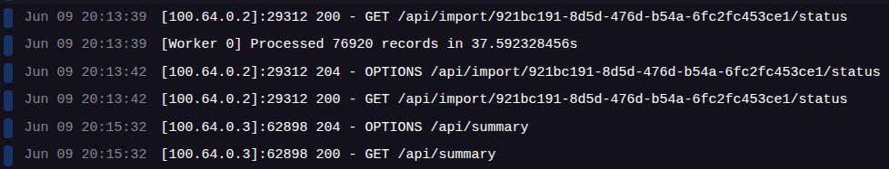

#  Importer API

  


  

API para importar arquivos XML (via `.xlsx`), processar dados com workers e persistir no banco. Oferece endpoints para gerenciamento de clientes, produtos, notas fiscais e visualização de resumo no dashboard.

  

## Eficiência

⚡ Importação de 76.920 registros concluída em apenas 37 segundos.
Desempenho de produção com arquitetura assíncrona, batch otimizado e persistência eficiente.



  

##  Autenticação

  

Autenticação JWT obrigatória para acessar rotas privadas.

  

###  Headers obrigatórios:

  

```http

Authorization: Bearer <seu_token>

  

```

  

###  Endpoints públicos:

  

-  `POST /api/login`

-  `POST /api/register`

  

----------

  

##  Importação de XML

  

`POST /api/import/xml`

  

**Body (multipart/form-data):**

  

-  `file`: arquivo `.xlsx` com os dados do XML convertido

  

**Resposta:**

  

```json

{

"status":  "success",
"data": {
	"import_id": "65ddf6c5-a878-4d7a-8f0a-68538733421f",
	"status": "queued"
},
"message":  "File will be processed in the background"

}

  

```

`POST /api/import/:id/status`
  

**Resposta:**

```json

{
"data": {
	"id": 1,
	"import_id": "65ddf6c5-a878-4d7a-8f0a-68538733421f",
	"file_name": "Reconfile fornecedores.xlsx",
	"status": "completed",
	"created_at": "2025-06-08T14:49:51.517545-03:00",
	"updated_at": "2025-06-08T14:50:21.762625-03:00"
},
"status": "success"
}

```
 
----------

  

##  Endpoints de Recursos

  

###  `/api/customers`

  

- Lista de clientes com paginação e filtros

-  **Query params:**  `page`, `pageSize`, `name`, `country`

  

###  `/api/products`

  

- Lista de produtos com paginação

-  **Query params:**  `page`, `pageSize`, `name`, `publisher_id`

  

###  `/api/invoices`

  

- Lista de notas fiscais com filtros por data, mês e ano

-  **Query params:**  `page`, `pageSize`, `month`, `year`,`customer_id`

  

###  `/api/invoice-items`

  

- Lista de itens por nota fiscal

-  `GET /api/invoice-items/:id`: detalhes de um item

  

###  `/api/invoice-items`

  

- Lista de itens com filtros, ordenamentos e paginação

-  `GET /api/invoice-items`

-  **Query params:**  `page`, `pageSize`, `invoice_id`, `product_id`,`credit_type`, `orderBy`, `order`

  

###  `/api/summary`

  

- Retorna resumo consolidado (usado no dashboard)

  

----------

  

##  Exemplo de Autenticação e Consumo com JWT

  

```http

POST /api/register

Content-Type: application/json

  

{

"first_name": "user",

"last_name": "example",

"email": "user@example.com",

"password": "123456",

"confirm_password": "123456"

}

  

```

  

```http

POST /api/login

Content-Type: application/json

  

{

"email": "user@example.com",

"password": "123456"

}

  

```

  

**Resposta:**

  

```json

{

"data":  {

"token":  "<jwt-token>",

"user":  {

"id":  1,

"first_name":  "user",

"last_name":  "example",

"email":  "user@example.com",

}

},

"error":  false,

"message":  "Login successful"

}

```

  

Use esse token nos headers para acessar outras rotas:

  

```http

Authorization: Bearer <jwt_token>

  

```

  

----------

  

##  Importação para Insomnia/Postman

  

Importe o arquivo `docs/insomnia-export.yaml` no Insomnia ou Postman para testar todos os endpoints rapidamente.

  

> No Insomnia: `File > Import > From File` e selecione o `.yaml`

  

----------

  

##  ⚡ Tecnologias Utilizadas

  

-  **Go** + **Fiber**

-  **GORM** + PostgreSQL

-  **JWT** para autenticação

-  **Excelize** para leitura de arquivos

-  **Workers** para processamento assíncrono

  

----------

  

###  Arquitetura e Tecnologias

  

- Arquitetura orientada a serviços com **workers assíncronos**

- Importação massiva de arquivos `.xlsx` com **leitura por stream**

- Sistema de **persistência eficiente com batchs otimizado.**

-  **Autenticação JWT** protegendo as rotas privadas

-  **Rotas RESTful** com paginação e filtros

#### Link do repositório: [xml-importer-web](https://github.com/JuniorPaula/xml-importer-web.git) 

##  Para rodar o projeto localmente:

  

```bash

git  clone  https://github.com/JuniorPaula/xml-importer-api.git

cd  xml-importer-api

cp  .env.example  .env

make up && make  run

  

```

#### Helper
```bash

make help

```
  

----------

  

Feito com ❤️ por Junior P.